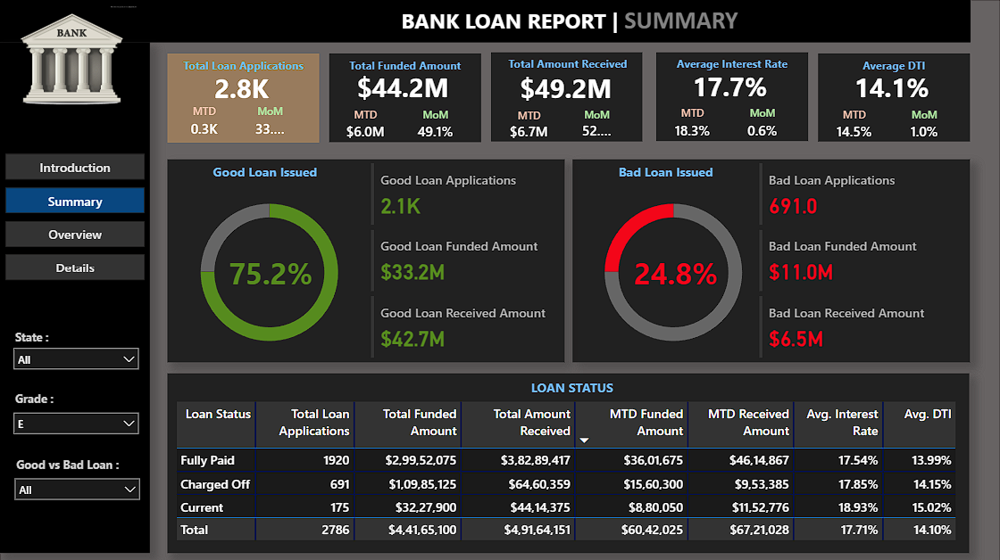

# 📊 Detailed Dashboard Breakdown

The project is structured into three distinct layers of analysis, moving from high-level financial health to granular transaction details. Each dashboard serves a specific business function within the lending lifecycle.

---


### 1. Executive Summary Dashboard
**Focus:** Financial Health & Portfolio Performance

The Summary dashboard provides a consolidated view of the bank's lending efficiency. It is designed to help stakeholders monitor the return on investment and risk exposure in real-time.

* **Key Performance Indicators (KPIs):**
    * **Total Loan Applications:** Measures the volume of demand. In this dataset, there are **38.6K** applications.
    * **Total Funded Amount:** The total principal amount disbursed to borrowers (**$435.8M**).
    * **Total Amount Received:** Tracks the cash inflow (**$473.1M**). By comparing this to the funded amount, stakeholders can immediately assess profit margins.
    * **MTD & MoM Indicators:** Every KPI is compared against the previous month. For example, a **6.9% MoM increase** in applications indicates growth, while MTD figures help in tracking monthly targets.

* **Good Loan vs. Bad Loan Analysis:**
    * **Good Loans (86.2%):** These are the revenue-generating assets consisting of 'Fully Paid' and 'Current' loans.
    * **Bad Loans (13.8%):** These represent 'Charged Off' loans. Monitoring this specific percentage is critical for maintaining the bank's capital adequacy ratio and identifying when credit policies need to be tightened.

* **Loan Status Grid:**
    * This table provides a detailed breakdown of metrics categorized by status. It allows for a quick audit of how much capital is tied up in "Current" loans versus how much has been successfully recovered from "Fully Paid" loans.

---

### 2. Trends & Overview Dashboard
**Focus:** Pattern Recognition & Borrower Demographics

The Overview dashboard transitions from financial numbers to behavioral patterns. It answers the question: *Who is borrowing, where are they located, and for what purpose?*

* **Monthly Trends (Line Chart):**
    * Visualizes the seasonality of loan applications. It helps the bank identify peak months (like the surge in December) to manage liquidity and staffing levels effectively.

* **Regional Analysis (State Map):**
    * Identifies geographical "Hotspots." High volumes in states like California (CA) or Texas (TX) may lead the bank to offer region-specific promotional rates or adjust risk parameters based on local economic conditions.

* **Loan Term & Home Ownership:**
    * **Term (Donut Chart):** Shows the split between 36-month and 60-month loans. A higher preference for 36-month terms suggests borrowers prefer faster debt clearance.
    * **Home Ownership (Tree Map):** Categorizes borrowers by their housing status (Mortgage, Rent, Own). This is a strong proxy for financial stability and collateral potential.

* **Purpose & Employment (Bar Charts):**
    * **Purpose:** Highlights that 'Debt Consolidation' and 'Credit Cards' are the primary drivers.
    * **Employment Length:** Analyzes the correlation between job stability and loan volume. Borrowers with **10+ years of experience** are the most active, representing a more stable borrower segment.

---

### 3. Details Dashboard
**Focus:** Granular Auditing & Tactical Reporting

The Details dashboard acts as the "Source of Truth." While the previous dashboards provide aggregations, this page provides access to the raw data behind the visuals.

* **The Transactional Grid:**
    * A comprehensive table listing every loan application with attributes like **ID, State, Purpose, Grade, Amount, Interest Rate, and DTI.** * This is used by loan officers for "Drill-to-Detail" actions—for instance, if the Summary dashboard shows a spike in Bad Loans, an officer can use this page to find exactly which IDs are responsible.

* **Interactive Slicers:**
    * Includes advanced filtering options for **State, Grade, and Loan Purpose.**
    * These filters allow users to perform hyper-local or category-specific audits. For example, filtering by "Grade G" and "Charged Off" reveals the riskiest segments of the portfolio for immediate review.

* **Technical Goal:**
    * This dashboard ensures transparency. By providing row-level data, it allows for manual verification of the calculations seen on the higher-level dashboards, fostering trust in the data-driven insights.

---

### 🛠️ Technical Logic Summary
* **Aggregation:** Data is aggregated at the Month and Year levels to provide MoM comparisons.
* **Calculated Metrics:** DAX is used to dynamically switch between "Total Applications," "Funded Amount," and "Received Amount" based on user selection.
* **Risk Categorization:** Logical functions classify loans into "Good" and "Bad" based on the `loan_status` field from the raw dataset.

---

## 🧮 Key DAX Measures

Below is the comprehensive list of DAX formulas used to calculate the KPIs and time-intelligence metrics.

```dax
-- 1. PRIMARY KPIs
Total Loan Applications = COUNT('Bank Loan Dataset (1)'[id])
Total Funded Amount = SUM('Bank Loan Dataset (1)'[loan_amount])
Total Amount Received = SUM('Bank Loan Dataset (1)'[total_payment])
Avg Interest Rate = AVERAGE('Bank Loan Dataset (1)'[int_rate])
Avg DTI = AVERAGE('Bank Loan Dataset (1)'[dti])

-- 2. TIME INTELLIGENCE (MTD)
MTD Loan Applications = TOTALMTD([Total Loan Applications], 'DateTable'[Date])
MTD Funded Amount = TOTALMTD([Total Funded Amount], 'DateTable'[Date])
MTD Amount Received = TOTALMTD([Total Amount Received], 'DateTable'[Date])

-- 3. MONTH-OVER-MONTH (MoM) GROWTH
MoM Applications % = 
VAR _prev_month = CALCULATE([Total Loan Applications], DATEADD('DateTable'[Date], -1, MONTH))
RETURN DIVIDE([MTD Loan Applications] - _prev_month, _prev_month, 0)

-- 4. GOOD VS BAD LOAN LOGIC
Good Loan % = DIVIDE(CALCULATE([Total Loan Applications], 'Bank Loan Dataset (1)'[loan_status] IN {"Fully Paid", "Current"}), [Total Loan Applications])
Bad Loan % = DIVIDE(CALCULATE([Total Loan Applications], 'Bank Loan Dataset (1)'[loan_status] = "Charged Off"), [Total Loan Applications])
Good Loan Funded Amount = CALCULATE([Total Funded Amount], 'Bank Loan Dataset (1)'[loan_status] IN {"Fully Paid", "Current"})
Bad Loan Received Amount = CALCULATE([Total Amount Received], 'Bank Loan Dataset (1)'[loan_status] = "Charged Off")
  
